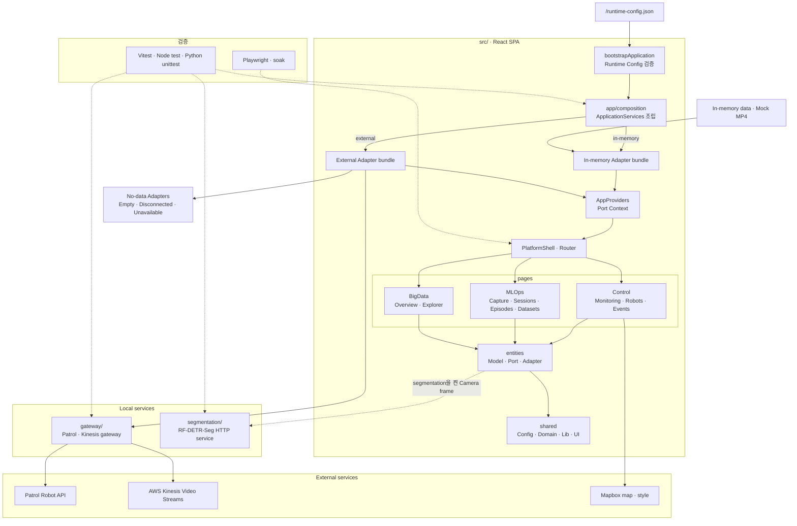

# ROBOT Army TIGER+

ROBOT Army TIGER+는 로봇 상태와 카메라 영상을 확인하고, 데이터 수집부터 Episode·Dataset 구성과 운영 데이터 분석까지 한곳에서 수행하는 웹 기반 로봇 운영 플랫폼이다.

## 주요 기능

- 로봇 목록, 운영 상태와 위치 지도 조회
- 다중 카메라 모니터링과 Kinesis Viewer 재생
- 브라우저 영상 녹화와 RF-DETR-Seg 오버레이
- 데이터 수집 Session 실행과 Episode 관리
- `/collect/quest` 기반 Quest Hand Pose collector와 Human Demonstration source binding
- Dataset 구성, 검색과 내보내기
- 운영 이벤트 조회와 BigData 분석

## 요구 환경

- Node.js 22.12 이상
- npm 10 이상
- Real 실행 시 Patrol API와 Kinesis에 접근할 수 있는 서버 환경
- 세그멘테이션 사용 시 RF-DETR-Seg와 PyTorch를 설치한 Python 환경

## 설치

```bash
npm ci
```

Real을 실행하거나 Mapbox 지도를 사용하려면 `.env.example`을 `.env.local`로 복사한 뒤 값을 입력한다.

PowerShell:

```powershell
Copy-Item .env.example .env.local
```

macOS 또는 Linux:

```bash
cp .env.example .env.local
```

`VITE_*` 값은 브라우저 bundle에 포함될 수 있으므로 비밀값을 넣지 않는다. Patrol 인증값은 브라우저가 아니라 local gateway에서만 읽는다.

## Mock 실행

Mock은 외부 API 없이 전체 화면과 사용자 흐름을 확인할 때 사용한다.

```bash
npm run dev:mock
```

기본 주소는 `http://localhost:5173`이다. 해당 port가 사용 중이면 Vite가 터미널에 출력한 다음 주소로 접속한다. Mock은 in-memory 데이터, 합성 위치와 저장소에 포함된 Mock 영상을 사용한다.

새 수집 화면에서 작업 ID·작업 지시·장치 ID를 직접 입력한 뒤 세션을 생성한다. Mock 시연용 입력값은 [시연 가이드](docs/demo-guide.md#데이터-수집--카탈로그--데이터셋)를 참고한다. Real 모드도 PC의 **수집 → 새 수집**에서 Quest 손 추적 세션을 생성한다. Quest 브라우저의 `/collect/quest`에서 세션 코드를 입력하고 MR을 시작하면 PC 수집 콘솔에서 손 추적 확인, Episode 녹화·정지·저장을 할 수 있다. 원본은 gateway의 `data/quest/`에 보관한다. 실행과 연결 순서는 [Real Quest 수집 안내](docs/quest-live.md)를 따른다. 실행 방식 선택은 Composition에서 처리하고 제품 화면에는 표시하지 않는다.

수집 콘솔의 **장치** 탭에서 **시뮬레이션 수집**으로 이동하면, Quest로 WebXR 시뮬레이션에서 임무를 수행하면서 시뮬레이션 화면·수집 카메라·실시간 수집 데이터를 한 화면에서 함께 본다. 접속 주소는 `VITE_SIMULATION_ORIGIN`으로 설정하며 연결 순서는 [시뮬레이션 수집 안내](docs/simulation-collection.md)를 따른다.

## Real 실행

Real은 Patrol Robot API와 Kinesis 영상을 사용한다. `.env.local`에 다음 항목을 설정한다.

- `VITE_MAPBOX_ACCESS_TOKEN`
- `VITE_MAPBOX_STYLE_URL`
- `VITE_MAPBOX_SECONDARY_STYLE_URL`
- `PATROL_ORIGIN`
- `PATROL_API_KEY`
- `PATROL_API_SECRET`
- `PATROL_CAMERA_CONFIG_PATH`
- `PATROL_ROBOTS_JSON`
- `PATROL_API_REQUEST_TIMEOUT_MS` (필수, Patrol API 요청 제한 시간 ms)
- `PATROL_STATUS_POLL_INTERVAL_MS` (필수, Patrol 운영 주체가 승인한 REST 조회 주기 ms)
- `PATROL_EVENT_BATTERY_LOW_THRESHOLD` (필수, ADS-1 이벤트를 발생시킬 배터리 잔량 백분율)

첫 번째 터미널에서 gateway를 실행한다.

```bash
npm run gateway:dev
```

두 번째 터미널에서 Real frontend를 실행한다.

```bash
npm run dev:real
```

gateway는 기본적으로 `127.0.0.1:8787`에서 frontend 요청을 처리한다. 브라우저에서는 기본 `http://localhost:5173` 또는 Vite가 터미널에 출력한 주소로 접속한다.

gateway는 등록된 Robot의 운영 상태를 승인된 주기로 REST API에 요청하고, 상태 화면과 이벤트 수집기가 같은 upstream 요청을 공유한다. 각 Patrol API 요청은 `PATROL_API_REQUEST_TIMEOUT_MS`가 지나면 중단된다. 이벤트 수집기는 실패 후에도 같은 주기로 복구를 시도하며 `OSA-1` 온라인, `OSA-2` 오프라인, `ADS-1` 배터리 부족 상태 전이만 중복 없이 기록한다. 이벤트 조회와 변경 알림은 gateway의 JSON API와 SSE로 제공한다. 최근 10,000개 이벤트는 gateway process lifetime 동안 유지되므로 process 재시작 간 영속 보관이 필요하면 별도 저장소를 연결해야 한다. 코드에는 요청 제한 시간, poll 주기나 배터리 임계치의 임의 기본값이 없다.

AI 세그멘테이션도 사용할 때는 별도 터미널에서 서비스를 실행한다.

```bash
npm run segmentation:dev
```

`SEGMENTATION_PYTHON`을 지정하지 않으면 프로젝트 `.venv`와 시스템 Python 순서로 실행 파일을 찾는다. 설치 방법은 [segmentation/README.md](segmentation/README.md)를 참고한다.

## Mock과 Real의 차이

| 기능 | Mock | Real |
| --- | --- | --- |
| Robot 목록·운영 상태 | in-memory | Patrol gateway |
| 카메라 | Mock MP4 | Kinesis Viewer |
| 위치 | 합성 위치와 마커 | 판교역 중심 기본 지도, 위치 데이터가 없으면 마커 없음 |
| Telemetry | in-memory | 연결 안 됨 |
| Quest 손 추적 | 시뮬레이션 | WebXR → Quest 중계 서버 → PC 수집 콘솔 |
| 수집·Episode | in-memory | Quest 손 추적 세션 생성·녹화·원본 저장 |
| Dataset 및 기타 수집 장치 | in-memory | 빈 결과, 쓰기 사용 불가 |
| 이벤트·분석 | in-memory | 이벤트는 Patrol gateway 상태 전이, 분석은 빈 결과 |

Real은 `external` bundle만 선택한다. 데이터가 없는 조회는 Empty, 연결 실패는 Error, 제공하지 않는 작업은 사용 불가 상태로 표시하며 in-memory 데이터로 바꾸지 않는다.

## Production build

Mock과 Real은 별도 명령으로 build한다.

```bash
npm run build:mock
npm run build:real
```

`npm run build`는 `build:mock`과 같다. 두 명령 모두 결과를 `dist/`에 만든다.

- Mock build: `runtime-config.json`과 Mock 영상 포함
- Real build: external `runtime-config.json` 포함, Mock config와 Mock 영상 제외

이전 결과와 섞이지 않도록 배포할 mode를 build한 직후 `dist/` 전체를 배포한다.

## 검증

기본 검증:

```bash
npm run verify
```

이 명령은 TypeScript, ESLint, 디자인 시스템·저장소 안전 검사, frontend unit test, gateway, Node 도구와 Python segmentation unit test를 실행한다.

커밋할 내용만 별도로 검사하려면 다음 명령을 실행한다. 자격 증명 형식과 로컬 설정 파일을 검사하며, 발견한 값 대신 파일 경로와 줄 번호를 출력한다.

```bash
npm run check:repository-safety -- --staged
```

브라우저 회귀:

```bash
npm run verify:browser
```

장시간 Telemetry·MediaStream 정리:

```bash
npm run test:e2e:soak
```

주요 개별 명령은 다음과 같다.

```bash
npm run typecheck
npm run lint
npm run test:unit
npm run test:gateway
npm run test:segmentation
```

## Runtime Config

앱은 React를 시작하기 전에 `/runtime-config.json`을 읽고 검증한다. 개발 서버와 build 단계는 실행 명령에 맞는 Mock 또는 Real Config를 같은 경로에 제공한다.

Runtime Config는 브라우저에서 읽을 수 있으므로 인증정보를 넣지 않는다. 배포 서버는 해당 파일을 `Cache-Control: no-store`로 제공하고, 실제 파일이 없는 SPA route만 `/index.html`로 보낸다.

## 프로젝트 구조

앱은 React를 마운트하기 전에 Runtime Config를 검증하고 완전한 Adapter bundle 하나를 조립한다. 화면은 `AppProviders`가 제공하는 Port를 사용하며 선택된 Adapter 구현을 직접 확인하지 않는다.



```text
src/
├─ app/       # 시작, 조립, provider와 route
├─ pages/     # Control, MLOps와 BigData 화면
├─ widgets/   # Platform shell
├─ entities/  # 업무 모델, Port와 Adapter
└─ shared/    # 공통 설정, domain, 도구와 UI

gateway/      # Patrol API와 Kinesis gateway
segmentation/ # RF-DETR-Seg HTTP service
public/       # Runtime Config와 정적 asset
scripts/      # smoke test와 로컬 실행 도구
e2e/          # Playwright 회귀
```

의존 방향은 `app → pages → widgets → entities → shared`다. 상위 레이어는 필요한 하위 레이어만 사용하고, Slice 외부에서는 각 Slice의 Public API를 import한다.

## Physical AI Flywheel 범위

MLOps Mock 모드는 다음 순환 흐름을 상태형 in-memory Port로 제공한다.

`Capture → Episode/Drive/Intervention → Annotation/QC → Dataset Version → Training → Evaluation → Model Registry → Deployment → Inference → Failure/Data Gap`

- 휴머노이드 수집은 한 Capture Session에서 여러 Episode를 순차 기록한다. 동시에 두 Episode를 기록할 수 없다.
- 사족·모바일 수집은 연속 Drive와 Recording Chunk를 만들며, `autonomous → teleop/manual` 전환 시 Intervention을 자동 생성한다.
- Dataset Version은 `humanoid-episode`, `drive-window`, `intervention-window` 중 한 종류만 포함한다.
- Released Dataset만 Training에 사용할 수 있고, 통과한 Evaluation이 없는 Model은 Production 승격과 Deployment가 차단된다.
- Training, Evaluation, Deployment는 입력과 Fixture에 의해 결정되는 단계별 상태와 구독 이벤트를 제공한다.
- Mock 상태는 메모리에 유지되며 같은 브라우저의 열린 탭끼리 공유한다. 다른 탭이 열려 있으면 새로고침한 탭도 상태를 다시 받는다. 모든 탭을 닫거나 마지막 탭을 새로고침하면 초기 Fixture로 돌아간다.

Real 모드는 동일한 Route와 Port 계약을 유지하지만 신규 Backend endpoint가 정의되지 않은 기능은 빈 조회 결과를 표시한다. Command는 `이 실행 환경에서는 지원하지 않는 작업입니다` 오류로 종료하며 Mock Fixture로 자동 전환하지 않는다. 실제 ROS ingestion, Object Storage, GPU scheduler, 학습 실행과 Robot deployment는 Port 외부 책임이다.

## 추가 문서

- [관제·데이터 수집 시연 가이드](docs/demo-guide.md)
- [디자인 시스템](docs/design-system.md)
- [기여 및 검증 규칙](CONTRIBUTING.md)
- [세그멘테이션 설치와 실행](segmentation/README.md)
